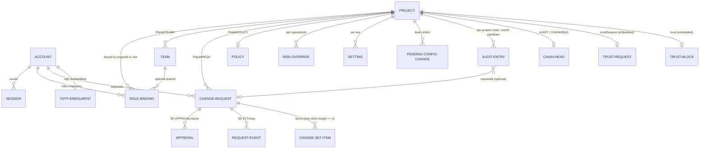

# Domain model

Entities, relations, persistence, and the audit-event catalog for the Cloud Control Plane. All facts below are measured directly from the code at commit `d781c25d828bd580dd2c426e6337b523cdb05511` (2026-07-17, post-rename merge). Identifiers appear exactly as they do in code (`ccp-api`, `catalogctl`). Every claim carries a `file:line` citation; re-check any table with the commands in "Regenerate / verify" at the end.

## 1. Where truth lives

There are two persistence worlds. Do not confuse them.

| World | What it holds | Persistence | Source of truth for |
|---|---|---|---|
| `ccp-api` durable store | Accounts, sessions, teams, policy, settings, risk overrides, change requests, approvals, pending config changes, projects registry, hash-chained audit | `FileStore` JSON snapshot on disk (ccp/api/src/store/fileStore.ts:24) | Everything in api mode — "the server owns the truth" (ccp/api/src/domain/config.ts:8-9) |
| SPA mock-mode stores | Demo accounts, teams, policy, risk overrides, settings, a flat (non-chained) audit list | Browser `localStorage` with in-memory fallback (ccp/app/src/lib/accounts.ts:70-92) | Mock/demo mode only; "a real `ccp-api` would keep the same shape server-side" (ccp/app/src/lib/accounts.ts:8-9) |

The authoritative item shapes are the zod schemas in ccp/api/src/store/schema.ts (module doc: schema.ts:4-13). The SPA types in ccp/app/src/types/ are the client projections.

## 2. Entity catalog

### 2.1 Global identity (NOT project-scoped)

| Entity | Store key (PK / SK) | Key fields | Invariants and guards |
|---|---|---|---|
| Account (`AccountItem`, ccp/api/src/store/schema.ts:94-216) | `ACCOUNT#<username>` / `META` (schema.ts:569-571) | `id`, `username`, `displayName`, `roles` (per-project map, schema.ts:109), legacy `role`/`teamId`/`projects` (schema.ts:117-142), `status: active\|disabled` (:120), `credential {algo: argon2id\|pbkdf2}` (:34-39, :143), `failedAttempts`/`lockedUntil` (:144-145), `sessionVersion` (:146), `accountVersion` (:161, :183), `totpRequired` (:134), legacy `totp {secretEnc, enrolledAt}` (:41, :190), **`totpDevices[]`** (`TotpDevice[]`, :204 — 2026-07-22, account & security), **`recoveryCodes`** (`RecoveryCodes`, :212 — 2026-07-22, account & security), `isAdmin` (:124), `mustChangePassword` (:123) | Username uniqueness is structural — the username IS the PK, and enroll/import write `ifNotExists` (ccp/api/src/routes/migrate.ts:90). Authorization is read ONLY through `rolesOf`/`roleFor`, never `account.role` directly (schema.ts:100-116). `accountVersion` is a monotonic drift counter guarding dual-control replays — a stale ack fails 409 `STALE_PROPOSAL` (schema.ts:147-161); every self-service device/codes/password/session mutation bumps it too. Last-active-Lead/admin guard: server returns 422 `LAST_LEAD_GUARD` (ccp/api/src/routes/admin.ts:443, :459, :575, :584; ccp/api/src/errors.ts:52); the SPA mock enforces the same in ccp/app/src/lib/accounts.ts:227-236 (last admin), :299-325 (last Lead on disable/demote), :353-365 (delete: never yourself, never last admin/Lead). `totp`/`totpDevices` are read ONLY through the shim `auth/totp.ts#totpDevicesOf`, never directly — contract-tested (`test/totpDeviceShim.test.ts`). |
| TOTP device (`TotpDevice`, schema.ts:49-56) | value of `AccountItem.totpDevices[]` | `id` (ulid; the shim's synthetic `'legacy'` id never round-trips through this schema), `name`, `secretEnc`, `enrolledAt`, `lastUsedAt?` | Cap `MAX_TOTP_DEVICES` = 5 (auth/totp.ts:113), enforced at every write site, never in the schema. Any ONE device satisfies a login challenge (`verifyAnyTotpDevice`); an enrolled account is challenged at every login regardless of `totpRequired` (ADR-0024 clause 4). A present-but-empty `totpDevices` array is authoritative — same "present wins over legacy" rule `roles` already uses — so a fully de-enrolled account never resurrects the legacy `totp` secret. |
| Recovery codes (`RecoveryCodes`/`RecoveryCode`, schema.ts:58-63) | embedded on `AccountItem.recoveryCodes` | `codes[]` (`{hash, usedAt?}`), `generatedAt` | 10 codes, sha256 at rest (never the plaintext — that exists only in the one response that mints them), replaced wholesale on regenerate. Present only while the account holds ≥1 device — auto-issued at the FIRST device's confirmation, deleted when the last device is legitimately removed or by admin `reset-totp` (which clears both `totpDevices` and `recoveryCodes` in the same write). Break-glass only: never a login factor, never valid for re-auth, never counted toward founding-complete. |
| Role binding (`RoleBinding`, schema.ts:31) | value of `AccountItem.roles`, keyed by `projectId` or `'*'` | `role: requester\|approver\|lead` (schema.ts:17), optional `teamId` | `'*'` = all-projects wildcard, bootstrap/migration-only; admin verbs refuse it (ccp/api/src/routes/admin.ts:49, :326, :404). Map key set IS the membership set (schema.ts:102-104). |
| Session (`SessionItem`, schema.ts:223-263) | `SESSION#<sha256(token)>` / `META` (schema.ts:572-574) | `userId`, `issuedAt`, `lastSeenAt`, `absoluteExpiresAt`, `sessionVersion`, `ttl` (epoch seconds), `pending: totp\|enroll` (:233), `enrollSecretEnc` (:241 — first-login enrolment hold, paired with `pending:'enroll'`, OR the standing self-service device-add hold on a FULL session, paired with the field below instead of `pending`), **`enrollOfferedAt`** (:250 — when the standing device-add secret was minted; 2026-07-22, account & security), **`reauthAt`** (:261 — the re-authentication elevation stamp, set by `POST /auth/reauth`; 2026-07-22, account & security) | Server stores only the token's sha256 (ccp/api/src/auth/sessions.ts:16-24). TTLs: `ABSOLUTE_MS` = 12h, `IDLE_MS` = 30m (sessions.ts:9-10). Pre-sessions (TOTP pending) live 5 minutes: `TOTP_PENDING_MS` (auth/sessions.ts). The standing device-add hold reuses the same 5-minute window; `reauthAt` reuses a separate `REAUTH_MS` = 10 minutes (auth/sessions.ts). Both new fields are additive-optional and per-session — absent on every legacy session (fail closed: "never elevated," not "elevated at epoch"), and never survive sign-out/revocation/a `sessionVersion` bump. Sessions are never imported by migration (ccp/api/src/routes/migrate.ts:16-17). |
| TOTP enrolment — **legacy** (`Totp`, schema.ts:41) | embedded on `AccountItem.totp` | `secretEnc` (encrypted secret), `enrolledAt` | **Superseded 2026-07-22 (account & security) by the `TotpDevice`/multi-device rows above** — stays in the schema so every already-stored row still parses; read only through the shim (`auth/totp.ts#totpDevicesOf`), never directly. A legacy row with `totp` set is indistinguishable at login from a one-device account named "Authenticator"; the account's first device mutation (self-service add, or a first-login TOTP verify that stamps `lastUsedAt`) materializes `totpDevices` and deletes this field — lazy, idempotent, no migration script, no downtime. Effective requirement is unchanged by any of this: `needsTotp(account) = account.totpRequired ?? (isSeniorAnywhere(account) \|\| account.isAdmin === true)` (auth/totp.ts:67-71; [PERMISSIONS.md §8](PERMISSIONS.md#8-effective-2fa-rule)) — only the login CHALLENGE condition widened (an enrolled account is always challenged, `PERMISSIONS.md` §8). |
| Project (`ProjectItem`, schema.ts:536-555) | `PROJECT#<id>` / `META` — global, the registry DEFINES the namespace (schema.ts:529-535, :578-581) | `id`, `name`, `github {owner, repo}`, `accountId` (AWS 12-digit, schema.ts:542), `region`, `status`, `version`, `trustRequest`, `trust`, `artifacts` | Status is a strict forward ladder: `draft → pending-trust → trusted → ready` (`ProjectStatus`, schema.ts:526); only `ready` (and unarchived) projects join `knownProjects()` — fail closed at every earlier rung (schema.ts:533-534; ccp/api/src/projects.ts). **Data-birth (2026-07-22, [ADR-0021](../../docs/adr/0021-ccp-control-scope-and-settlement.md)):** the old hardcoded default-project id is retired; the reserved control-plane scope `CONTROL_SCOPE = '@control'` is always known but is never a `ProjectItem` row (no registry entry ever exists for it, `GET /projects` never lists it) — see the Known-projects row in §4.3 below. |
| Settlement marker (`SettlementItem`, schema.ts:670-685) | `SETTLEMENT` / `META` — GLOBAL, one per store (`settlementKey()`, schema.ts:900) | `settledAt`, `settledBy` | **New in data-birth** ([ADR-0021](../../docs/adr/0021-ccp-control-scope-and-settlement.md)): presence means the one-time legacy-store settlement has already run (`domain/settlement.ts`) — idempotency guard, not scoped to any project. A store born entirely after this lane has nothing to settle (retro-register and materialize are both no-ops on it) but still gets the marker on first boot. |
| Project trust sub-records | embedded on `ProjectItem` | `ProjectTrustRequestRecord` (schema.ts:494-503): repo, commitSha, prescanSha256, parsed `PrescanReport` + `rawReport` bytes, plus (2026-07-24, easy-first-import) an optional `ci` block (see {@link CiProvenance} row below). `ProjectTrustBlock` (schema.ts:507-513): trustedBy, trustedAt, preScanReportSha256, commitSha. `ProjectArtifacts` (schema.ts:517-524): inventorySha256, blocksSha256, manifestsSha256 | `PrescanReport` is `.strict()` with the invariant `verdict === 'reject'` iff findings exist (schema.ts:472-487). `rawReport` never serializes to clients (schema.ts:492-493). `trust` is written ONLY by the dual-controlled trust flow, never accepted from a request body (schema.ts:505-506). A settlement-retro-registered `ProjectItem` (row above) deliberately carries no `trust` block — it never passed prescan trust, and that is recorded, not backfilled. |
| CI provenance (`CiProvenance`, schema.ts:588-599) | embedded on `ProjectTrustRequestRecord.ci` (optional) | `host: github\|gitlab`, `runUrl` (https-only, ≤500 chars) | **New 2026-07-24 (easy-first-import spec §3 A-iii, Phase 1).** `.strict()` — present only when a Bearer onboard-token CI lane uploaded the artifacts and chose to send it; absent on every session-uploaded row and every row written before this field existed. Rendered in the trust review so admins can cross-check the run URL against the Actions/pipeline log; never itself a trust input. |
| Onboarding token (`ProjectOnboardTokenItem`, schema.ts:879-892) | `PROJECT#<id>` / `ONBOARDTOKEN#<tokenId>` (`onboardTokenKey()`, schema.ts:1062-1064) | `tokenId`, `projectId`, `secretHash` (argon2id), `createdBy`, `createdAt`, `expiresAt`, optional `revokedAt` | **New 2026-07-24 (easy-first-import spec §3 A-ii, Phase 1).** The credential for the Bearer lane on `PUT /projects/:id/trust-request`. A SEPARATE type and key namespace from the CI upload token (`ProjectUploadTokenItem`, `PROJECT#<id>`/`UPLOADTOKEN#<tokenId>`, schema.ts:853-864 — not independently catalogued in this table, a pre-existing gap this row does not attempt to backfill) — the two are never cross-usable (I10). Mint (`POST /projects/:id/onboard-tokens`, lead+isAdmin) is legal ONLY while `status ∈ {draft, pending-trust}` — the exact inverse of the upload token's `{trusted, ready}` gate, so the two credentials' lifetimes never overlap; refused for an archived project. UNLIKE the upload token, revoke (`DELETE .../onboard-tokens/:tokenId`) does not delete the row: it stamps `revokedAt` (mirrors `ProjectItem.archived`) so the mint survives in the audit/history trail, and the Bearer lane's fail-closed gate checks `revokedAt` as its own explicit step. Deregistering a project also sweeps its `ONBOARDTOKEN#` rows (`domain/projectsLifecycle.ts`), same as `UPLOADTOKEN#`. |

### 2.2 Project-scoped governance (every PK carries the `P#<projectId>#` prefix)

| Entity | Store key (PK / SK) | Key fields | Invariants and guards |
|---|---|---|---|
| Team (`TeamItem`, schema.ts:191-201) | `P#<pid>#TEAM#<id>` / `META` (schema.ts:584-586) | `id`, `name`, `serviceSlugs`, `version` | A service belongs to exactly one team (single ownership); server-side `stripFromOthers` removes stolen slugs in the same transaction (ccp/api/src/routes/admin.ts:717-721, :850); SPA mock enforces the same (ccp/app/src/lib/teams.ts:171-181). SPA delete guards: no members, no services (teams.ts:194-204). |
| Policy (`PolicyItem`, schema.ts:203-215) | `P#<pid>#POLICY` / `CURRENT` or `VERSION#<n>` (schema.ts:587-592) | `low`, `medium`, `high`, `deleteMin` — each int 1..5 — plus `version`, `changedBy`, `configChangeId` | Missing policy row reads as `DEFAULT_POLICY` at version 0 (ccp/api/src/domain/config.ts:14-22). Any tier decrease classifies as loosening → dual control (ccp/api/src/domain/dualControl.ts:43-48). |
| Risk override (`RiskOverrideItem`, schema.ts:217-225) | `P#<pid>#RISKOVR#<opId>` / `CURRENT` (schema.ts:593-595) | `risk: LOW\|MEDIUM\|HIGH`, `version`, `setBy`, `setAt` | Effective risk = override if set, else manifest `riskFloor` (config.ts:29-38). Lowering risk is loosening (dualControl.ts:49-50). |
| Setting (`SettingItem`, schema.ts:227-236) | `P#<pid>#SETTING#<key>` / `CURRENT` (schema.ts:596-598) | `key`, `value` (unknown), `version`, `updatedBy`, `updatedAt` | Known keys in code: `freeze.global` (config.ts:46-48), `catalog.disabled-ops` (config.ts:50-52), `rate.limits` with defaults `{submissionsPerHour: 50, maxOpen: 20}` (config.ts:54-60). |
| ChangeRequest (`RequestItem`, schema.ts:238-366) | `P#<pid>#REQ#<ulid>` / `META` (schema.ts:599-601) | `id`/`requestUlid`, `requester`, `projectId` (denormalized; the key is truth, schema.ts:244-251), `teamId`, `service`, `operationId`, `macd`, `targetAddress`, `params`, `justification`, `exposure`, `reviewTier` (pinned at submit, :260-265), `risk`, `status` (free-text machine, :267-294), `approvalsRequired`, `approvals[]`, `schedule` (`now` \| `window {at, endAt?}`, :52-60), `items[]` (change set, :320-329), `replaceConfirmation` (:302-318), `pinnedDiff`/`planDigest`/`appliedSha`/`evidenceUrl` (auto-apply pin, :330-346), `events[]`, `policyVersion`, feasibility snapshot (:352-361) | `items` present ONLY for a true set (length ≥ 2); a single-op request's top-level fields ARE the one item (schema.ts:320-327). `replaceConfirmation` must equal `targetAddress` at submit for a forces-replace op (schema.ts:310-315). A request with no intact pin can never be auto-applied — `isPinIntact` requires `sha256(pinnedDiff) === planDigest`, fail closed (ccp/api/src/domain/apply/scheduler.ts:76-90). Submit idempotency: marker at `P#<pid>#IDEMPOTENCY#<actor>#<key>` resolves a resubmit to the FIRST request (schema.ts:602-607; written ifNotExists, ccp/api/src/routes/requests.ts:434). |
| Approval (`ApprovalItem`, schema.ts:368-374) | `P#<pid>#REQ#<ulid>` / `APPROVAL#<actorId>` (schema.ts:608-610) | `user`, `at` | One approval per actor per request, enforced by `ifNotExists` put in the approve transaction (routes/requests.ts:644). Also mirrored on `RequestItem.approvals`. |
| Request event (`RequestEventItem`, schema.ts:376-384) | `P#<pid>#REQ#<ulid>` / `EVT#<seq, zero-padded 6>` (schema.ts:611-613) | `at`, `type`, `label`, `actor?` | Timeline events; also mirrored on `RequestItem.events`. Catalog in section 5.2. |
| Pending config change (`PendingConfigChangeItem`, schema.ts:399-418) | `P#<pid>#CONFIGCHANGE#<ulid>` / `META` (schema.ts:614-616) | `kind`, `before`, `after`, `targetKey`, `apply` (`ApplySpec`, schema.ts:387-397), `proposedBy`, `status: PENDING\|APPLIED\|REJECTED\|EXPIRED\|SUPERSEDED`, `expiresAt`, `ackBy`, `ackAt` | Dual control: loosening changes need a SECOND distinct active admin (`SELF_ACK` refused, ccp/api/src/domain/dualControl.ts:233; errors.ts:22). 72h expiry (dualControl.ts:203). Drift guard: guarded attribute must still equal the propose-time value, else 409 `STALE_PROPOSAL` (dualControl.ts:239-253). `apply` never serializes to clients (`publicPendingChange`, dualControl.ts:159-178). |
| Audit entry (`AuditItem`, schema.ts:420-437) | `P#<pid>#AUDIT#<yyyymm>` / `<ulid>` (schema.ts:617-619) | `id`, `projectId`, `at`, `actor`, `action`, `targetType`, `targetId`, `before?`, `after?`, `requestId?`, `interimProfile?`, `prevHash`, `hash` | Hash-chained, tamper-evident, per-project (section 5.3). Month-partitioned; read back by walking month partitions backward until CHAINHEAD `count` entries are collected, bounded at 120 months (ccp/api/src/domain/auditQuery.ts:6-12, :48-56). |
| Chain head (`ChainHeadItem`, schema.ts:439-446) | `P#<pid>#AUDIT` / `CHAINHEAD` (schema.ts:620-622) | `hash`, `lastUlid`, `count` | Updated conditionally (`ifEquals hash`) in the SAME transaction as every audit put, so the chain cannot fork (ccp/api/src/domain/audit.ts:165-169). |

### 2.3 Client-side / configuration entities (ccp/app/src/types/ and lib/)

| Entity | Defined at | Notes |
|---|---|---|
| `User` (id, name, role, teamId, isAdmin?) | ccp/app/src/types/user.ts:17-25 | isAdmin is a capability separate from approval power — "A Lead is not automatically an admin" (user.ts:22-24). |
| `Team` (id, name, serviceSlugs) | ccp/app/src/types/user.ts:11-15 | Client projection of `TeamItem`. |
| `ChangeRequest` / `RequestStatus` / `ChangeSetItem` / `ChangeSetDraft` / `ApprovalStep` | ccp/app/src/types/request.ts:4-46, :88-108, :77, :110-207 | `RequestStatus` is a wide union including mock-only statuses; `APPROVED_COOLING`, `CANCELLED`, `WINDOW_EXPIRED` are api-mode only (request.ts:23-46). `ApprovalStep` is `L2 \| L3`; runtime truth is the api's `domain/exposure.ts#ladderFor` (request.ts:71-77). |
| `ProjectConfig` (id, name, github, region, seedLead, teams, providerTag?, providerAllowlist?, timezone?, timezoneLabel?) | ccp/app/src/types/project.ts:19-56 | The per-project file `catalogctl onboard` generates; makes the same build serve any imported repo (project.ts:3-10). |
| `ServiceManifest` / `ManifestOperation` | ccp/app/src/types/manifest.ts:236-242, :175-234 | The Service/operation catalog: `macd`, `codemodOp`, `riskFloor`, `exposure` (`l1_self_service \| l1_with_guardrails \| engineer_only`, manifest.ts:2), `forcesReplace`, `group`. `autoEligible` is deprecated/INERT and must never drive routing (manifest.ts:206-211). |
| `Inventory` / `InventoryResource` | ccp/app/src/types/inventory.ts:1-20 | Read-only Terraform estate baseline (address, resourceType, attributes) with git-derived provenance (`generatedAt`, `sourceCommit`). |
| SPA `Account` (mock) | ccp/app/src/lib/accounts.ts:15-46 | Passwords ONLY as salted PBKDF2-SHA256 hashes, 210,000 iterations (accounts.ts:21-23, :57), `MIN_PASSWORD = 8` (:56); username regex `^[a-z0-9._-]{2,32}$` (:245); uniqueness checked at enroll (:253-255). |
| SPA `AuditEntry` (mock) | ccp/app/src/lib/audit.ts:14-21 | `{id, at, actor, action, summary, projectId}` — flat, capped at 500 entries (audit.ts:26), NOT hash-chained. |

## 3. Relations



Keying relations (schema.ts:8-12): identity is GLOBAL (`ACCOUNT#…`, `SESSION#…`, `PROJECT#…`); EVERYTHING else is project-scoped under `P#<projectId>#`, including a per-project audit chain. Every project-scoped key helper takes `projectId` as its FIRST argument; no caller concatenates key strings by hand.

## 4. Persistence

### 4.1 The store seam

`ConfigStore` (ccp/api/src/store/configStore.ts:31-42) mirrors DynamoDB: `get`, conditional `put` (`ifNotExists`), `query` (PK + SK-prefix, SK-ascending), `queryGSI1`, all-or-nothing `transact` (every condition evaluated against the pre-transaction snapshot; one failure aborts the whole batch and throws `ConditionError` — configStore.ts:1-18, :13). `MemoryStore` implements it in-process (ccp/api/src/store/memoryStore.ts:20-96, fail-closed `ifEquals` against a missing item at :70-80). A DynamoDB implementation is planned behind the SAME seam (configStore.ts:2-3).

`FileStore extends MemoryStore` (ccp/api/src/store/fileStore.ts:24): the in-memory Map stays the read source of truth; after every APPLIED mutation the full state is snapshotted to ONE JSON file with a crash-safe atomic write (temp + fsync + rename, fileStore.ts:87-99), on a serialized write chain so snapshots land in mutation order (fileStore.ts:79-85). Boot fails closed on an existing-but-empty snapshot file (fileStore.ts:47-56). File location: `CCP_DATA_FILE` wins; else `<CCP_DATA_DIR>/ccp.json` with `CCP_DATA_DIR` defaulting to `.ccp-data` (ccp/api/src/deploy.ts:43-47). `CCP_STORE=memory` selects the non-durable store and is REFUSED in production (deploy.ts:35-37, :115). Bootstrap is refused once a data file exists (ccp/api/src/server.ts:61-69).

### 4.2 Key scheme (verbatim from the helpers)

| Helper (schema.ts line) | PK | SK |
|---|---|---|
| `accountKey(username)` (:569) | `ACCOUNT#<username>` | `META` |
| `sessionKey(tokenSha)` (:572) | `SESSION#<sha256(token)>` | `META` |
| `projectKey(id)` (:896) | `PROJECT#<id>` | `META` |
| `settlementKey()` (:900, data-birth) | `SETTLEMENT` | `META` — GLOBAL, one row per store |
| `teamKey(pid, id)` (:584) | `P#<pid>#TEAM#<id>` | `META` |
| `policyKey(pid)` (:587) | `P#<pid>#POLICY` | `CURRENT` |
| `policyVersionKey(pid, n)` (:590) | `P#<pid>#POLICY` | `VERSION#<n>` |
| `riskOverrideKey(pid, opId)` (:593) | `P#<pid>#RISKOVR#<opId>` | `CURRENT` |
| `settingKey(pid, key)` (:596) | `P#<pid>#SETTING#<key>` | `CURRENT` |
| `requestKey(pid, ulid)` (:599) | `P#<pid>#REQ#<ulid>` | `META` |
| `requestIdempotencyKey(pid, actor, key)` (:605) | `P#<pid>#IDEMPOTENCY#<actor>#<key>` | `META` |
| `approvalKey(pid, ulid, actor)` (:608) | `P#<pid>#REQ#<ulid>` | `APPROVAL#<actor>` |
| `eventKey(pid, ulid, seq)` (:611) | `P#<pid>#REQ#<ulid>` | `EVT#<seq padded to 6>` |
| `configChangeKey(pid, ulid)` (:614) | `P#<pid>#CONFIGCHANGE#<ulid>` | `META` |
| `auditKey(pid, yyyymm, ulid)` (:617) | `P#<pid>#AUDIT#<yyyymm>` | `<ulid>` |
| `chainHead(pid)` (:620) | `P#<pid>#AUDIT` | `CHAINHEAD` |

GSI1 partitions (one global secondary index, namespaced by prefix — schema.ts:624-639): `ACCOUNTS` (global account directory, :625-627), `SESSUSER#<userId>` (sessions per user, :575-577), `P#<pid>#TEAM` (:628-630), `P#<pid>#REQ` (:631-633), `P#<pid>#CONFIGCHANGE#PENDING` (:634-636; cleared by setting `GSI1PK: undefined` on ack/reject, dualControl.ts:257, :318), `PROJECTS` (:637-639).

### 4.3 Durable vs in-memory / browser-local

| Data | Durability |
|---|---|
| Everything under the `ConfigStore` (accounts, sessions incl. pre-sessions, requests, approvals, events, policy, settings, risk overrides, pending config changes, projects, audit chain) | Durable via `FileStore` snapshot (fileStore.ts:14-17) |
| Known-projects routing set | In-process CACHE of `{CONTROL_SCOPE} ∪ {store projects with status 'ready', unarchived}` — **store-only, data-birth ([ADR-0021](../../docs/adr/0021-ccp-control-scope-and-settlement.md))**: there is no baked estate id; a blank/freshly-founded store's cache is exactly `{'@control'}` until an account clears the real onboarding ladder (or a legacy store is settled — the `SettlementItem` row above). Resynced on complete/deregister/first-activation/unarchive (ccp/api/src/projects.ts; ccp/api/src/domain/projectsLifecycle.ts) |
| SPA mock stores | `localStorage` (in-memory Map fallback when storage is unavailable). Global key: `ccp.accounts.v1` (accounts.ts:58). Project-scoped keys: `ccp.<project>.<store>.v1` via `scopedKey` (ccp/app/src/lib/projectScope.ts:17-21) for `audit`, `teams`, `policy`, `risk-overrides`, `settings`, `pendingChanges` (audit.ts:25, teams.ts:20, policy.ts:30, riskOverrides.ts:16, settings.ts:103, pendingChanges.ts:35). Accounts and session are GLOBAL — never scoped (projectScope.ts:4-5). |
| App-bundled sample estate (`inventory.json`, `blocks/`, `project.json`, id `SAMPLE_ESTATE_ID='sample'`) | Static import in the JS bundle (`ccp/app/src/lib/api.ts`, `lib/httpApi.ts`) — **not durable state**, and **not the CI-generated default it used to be**. Data-birth (2026-07-22, [ADR-0020](../../docs/adr/0020-ccp-data-birth-blank-install.md)): frozen, byte-identical historical capture and test oracle, retired from the `portal-data-freshness` CI gate. Loads only in mock/standalone builds by default, or on an explicit "Load sample data" click (`lib/projectScope.ts`, `features/onboarding/FirstRunPage.tsx`) — never as an unconditional default a real API-backed install falls into. |

### 4.4 Schema version / migration notes

- There is NO numeric schema version on the durable store. Evolution is by ADDITIVE OPTIONAL fields with fail-closed read shims: `roles` supersedes legacy `role`/`teamId`/`projects`, canonicalized by `rolesOf` (schema.ts:100-142; ccp/api/src/projects.ts). **Data-birth (2026-07-22, [ADR-0021](../../docs/adr/0021-ccp-control-scope-and-settlement.md)):** a bare legacy row (neither `roles` nor `projects`) now maps to `{}` — member of NOTHING, never all-projects and never `{<legacy-project-id>: ...}` — the old legacy-id-only fallback (`rolesOf` arm 3) is retired. This is safe because the one-time boot settlement (`domain/settlement.ts`, `SettlementItem` row above) materializes an explicit `roles` map onto every such row, for any store that actually has one, before arm 3 is ever consulted at runtime — a real legacy store never actually reaches the `{}` floor; it is the fail-closed floor for the should-never-happen unsettled case. `reviewTier` derived fail-closed from `exposure` for pre-enforcement rows (schema.ts:260-265); `items` absent means single-op (schema.ts:320-328); Schedule v2 `endAt` optional on legacy rows, `windowEndOf` supplies `at + DEFAULT_WINDOW_MS` on read (schema.ts:52-56).
- v1 → v2 migration: `POST /migrate/v1` (ccp/api/src/routes/migrate.ts:53) accepts the five SPA localStorage stores verbatim (`ccp.accounts.v1`, `ccp.teams.v1`, `ccp.policy.v1`, `ccp.risk-overrides.v1`, `ccp.audit.v1` — migrate.ts:39-47); allowed ONLY while the backend holds just the bootstrap account (migrate.ts:58-60); imported accounts keep PBKDF2 and re-hash to argon2id on first login (migrate.ts:15-16; routes/auth.ts:113-115); sessions are never imported (migrate.ts:16-17); v1 audit rows become chained `v1-import` wrappers (migrate.ts:113-117).
- SPA legacy keys from the Gerbang era (`gerbang.audit.v1`, `gerbang.teams.v1`) are read once under the legacy project id and migrated to the namespaced key, then removed — never written again (ccp/app/src/lib/audit.ts:23-40; teams.ts:18-35).
- **Data-birth boot settlement** (2026-07-22, [ADR-0021](../../docs/adr/0021-ccp-control-scope-and-settlement.md), `domain/settlement.ts`): a store born under the old hardcoded default-project id may hold real per-project data under the legacy project's own partitions with no `ProjectItem` registry row for it. On first boot (and lazily per-request until the `SettlementItem` marker exists), settlement (a) retro-registers the legacy project id as `status:'ready'` with no `trust` block, iff a real legacy footprint exists and no registry row does yet, and (b) materializes every bare account row's implicit binding into an explicit `roles` map (the migration-shim bullet above). Both writes audit onto the `@control` chain (control-plane bookkeeping); the historical legacy-project audit chain is untouched. Idempotent and a no-op on a store that was never a legacy single-project deployment.
- Mock account seed refresh is versioned: `SEED_VERSION = 2` at `ccp.accounts.seedVersion`; a bump RESETS the mock store, api-mode identities untouched (accounts.ts:59-68, :378-386).

## 5. Event catalog

### 5.1 Hash-chained audit actions (`AuditItem.action`)

Every kind the api can emit, with where it is written and what the payload highlights are. "Via dual control" means the entry is passed as `CommitInput.audit` to `commitOrPropose` and is written ONLY when the change classifies as tightening (immediate apply, dualControl.ts:180-188); a loosening change instead produces `config-propose` → `config-apply`/`config-reject`.

| `action` | Emitted at | Actor | Payload highlights |
|---|---|---|---|
| `login-failure` | ccp/api/src/routes/auth.ts:94, :101 | account id, or `(unknown)` username | none (targetType `session`) |
| `login-lockout` | routes/auth.ts:94 (5+ failures → exponential backoff, capped 60m, :86-91) | account id | none |
| `login-1fa` | routes/auth.ts:123, :135 (password OK, TOTP step pending) | account id | none |
| `login-success` | routes/auth.ts:147 (requester, no 2FA), :205-211 (after a TOTP-verified login) | account id | none on the no-2FA path; `after: {deviceId}` on the TOTP-verified path (2026-07-22, account & security) — which device satisfied the challenge |
| `totp-enroll` | routes/auth.ts:247 (first-login enrolment — becomes the account's device #1, named "Authenticator") | account id | none (targetType `account`); paired with a `recovery-codes-generate` entry right after, since first enrolment auto-issues the code set |
| `totp-device-add` | ccp/api/src/routes/account.ts:140-146 (`POST /auth/totp-devices/confirm`, 2026-07-22, account & security) | account id (self) | `after: {deviceId, name}` |
| `totp-device-remove` | account.ts:186-193 (`DELETE /auth/totp-devices/:id`) | account id (self) | `before: {deviceId, name}`, `after: {totpEnrolled}` |
| `recovery-codes-generate` | account.ts:148-155 (first-device auto-issue via confirm), account.ts:231-237 (`POST /auth/recovery-codes/regenerate`), routes/auth.ts:249-256 (first-login enrolment auto-issue) | account id (self) | `after: {count}` — never the codes or their hashes |
| `recovery-code-used` | routes/auth.ts:307 (`POST /auth/totp/recovery`, a successful burn) | account id (self) | `after: {remaining}` |
| `recovery-codes-clear` | account.ts:194-202 (device-remove route only, when removing the LAST device deletes the code set with it — beyond the spec's literal audit-kind table, added for a complete before/after pair alongside `totp-device-remove`) | account id (self) | `before: {count}` |
| `reauth-success` | routes/auth.ts:440 (`POST /auth/reauth`) | account id (self) | none (targetType `session`) |
| `reauth-failure` | routes/auth.ts:427 | account id (self) | none (targetType `session`); feeds the same lockout counter as `login-failure` |
| `session-revoke-self` | account.ts:267 (`DELETE /auth/sessions/:id`, `after: {revoked: 1}`), account.ts:280 (`POST /auth/sessions/revoke-others`, `after: {revoked: n}`) | account id (self) | `after: {revoked}` |
| `password-change` | routes/auth.ts:380-386 (self-service) | account id | none by default; `after: {otherSessionsKept: true}` when the standing card's `keepOtherSessions` flag is used (2026-07-22, account & security) |
| `request-submit` | ccp/api/src/routes/requests.ts:388 | requester | `after`: status, approvalsRequired, risk, exposure, reviewTier; set item count + per-item (op, target, forces-replace ack) for a change set (requests.ts:385-387) |
| `request-approve` | routes/requests.ts:630 | approver | `before/after`: approvals count, status; `after` adds approvalsRequired, reviewTier, ladder step |
| `request-reject` | routes/requests.ts:690 | approver | before/after status |
| `request-link-pr` | routes/requests.ts:756 | actor | PR number/URL lane |
| `request-plan-summary` | routes/requests.ts:818 | actor (CI) | structured plan summary recorded |
| `request-cancel` | routes/requests.ts:866 | requester or Lead/admin | before/after status |
| `request-rewindow` | routes/requests.ts:974 | actor | old → new window |
| `request-apply` | ccp/api/src/domain/cooling.ts:52 (lazy cooling-off settle) | `system:cooling-window-elapsed` (cooling.ts:53) | `before {status: APPROVED_COOLING}` → `after {status: APPLIED\|AWAITING_DEPLOY_APPROVAL}` |
| `request-window-expired` | ccp/api/src/domain/schedule.ts:297 (lazy window settle) | `system:window-elapsed` (schedule.ts:298) | before/after status → `WINDOW_EXPIRED` |
| `policy-change` | ccp/api/src/routes/admin.ts:145 (via dual control) | admin | before/after policy quads |
| `setting-change` | routes/admin.ts:191 (via dual control) | admin | key, before/after value |
| `risk-override` / `risk-override-clear` | routes/admin.ts:247, :273 (via dual control) | admin | before/after risk |
| `catalog-toggle` | routes/admin.ts:302 (via dual control) | admin | `{enabled}` before/after |
| `account-enroll` | routes/admin.ts:364 (via dual control) | admin | public account + binding project (never credential material) |
| `account-update` | routes/admin.ts:546 (via dual control) | admin | before/after authorization shape |
| `account-rename` | routes/admin.ts:389-395 (direct, display name only) | admin | displayName before/after |
| `account-delete` | routes/admin.ts:589-593 (direct) | admin | `before`: displayName, status, isAdmin, `rolesOf(acc)` — never credential material (admin.ts:587-588) |
| `password-reset` | routes/admin.ts:631 (via dual control; senior reset = loosening, dualControl.ts:79-81) | admin | none |
| `team-create` / `team-rename` / `team-set-services` / `team-delete` | routes/admin.ts:722-725, :746, :770, :792 (direct) | admin | name/serviceSlugs; `stolenFrom` when single-ownership moved slugs |
| `totp-reset` | routes/admin.ts:813-816 (direct; availability recovery, applied immediately — admin.ts:807-809) | admin | `totpEnrolled` before/after |
| `sessions-revoke` | routes/admin.ts:834-836 (direct) | admin | none; sessionVersion bumped in same write |
| `config-propose` | ccp/api/src/domain/dualControl.ts:212-219 | proposing admin | kind, targetKey, `kindOfChange: 'loosening'`; `interimProfile: true` when a senior grant is proposed under the interim profile |
| `config-apply` | dualControl.ts:269-278 | acking admin | `before {proposedBy, before}`, `after {ackBy, after, kind, targetKey}`; interim flag recomputed fresh at ack (dualControl.ts:260-268) |
| `config-reject` | dualControl.ts:320 | acting admin | none |
| `project-register` | ccp/api/src/routes/projects.ts:247 | lead | public project |
| `onboard-token-mint` | routes/projects.ts:508-513 (2026-07-24, easy-first-import Phase 1; `POST /:id/onboard-tokens`, lead+isAdmin) | lead | `after: {tokenId, expiresAt}` — never the secret. Lands on the TARGET project's chain (data-plane-shaped, like `upload-token-mint`), not the acting scope's |
| `onboard-token-revoke` | routes/projects.ts:535-542 (`DELETE /:id/onboard-tokens/:tokenId`) | lead | `before: {tokenId, expiresAt}`, `after: {revokedAt}` — the row is tombstoned, not deleted (unlike `upload-token-revoke`'s row deletion); target chain |
| `project-trust-request` | routes/projects.ts:308 (session lane) — or (2026-07-24) the SAME action name from the onboard-token Bearer lane, routes/projects.ts:660-676 | uploader — a session actor id, or (Bearer lane) the string `onboard-token:<tokenId>` | commitSha, prescanSha256, verdict, findings count. The Bearer lane audits to the TARGET project's chain (no acting scope to use, same reasoning as the data-plane actions); the session lane is unchanged, still the acting scope's chain |
| `Trusted repo for onboarding` | ccp/api/src/domain/projectsLifecycle.ts:28-36 (post-ack hook for `project-trust` kind) | the ACKING admin (trustedBy in the payload is the proposing lead — projectsLifecycle.ts:11-13) | `after`: the trust block |
| `project-retro-register` | ccp/api/src/domain/settlement.ts (data-birth, 2026-07-22 — the one-time boot settlement's step 1; written on the `@control` chain, not the target project's) | `migration` | `after`: `{id: <legacy-project-id>, status: 'ready'}` — no `trust` block; see the `SettlementItem` entity above |
| `account-settlement` | ccp/api/src/domain/settlement.ts (data-birth — settlement's step 2, one entry per bare account row materialized; written on the `@control` chain) | `migration` | `after`: the explicit `roles` map stamped onto that row |
| `project-scope-denied` | ccp/api/src/middleware/authz.ts:59-66 (403 on unbound account; appended to the TARGET project's chain) | denied account | path, method, `boundTo` |
| `scheduler-frozen` | ccp/api/src/domain/apply/scheduler.ts:174-183 (ONE entry per frozen tick, not per request) | `system:scheduler` (`SCHEDULER_ACTOR`, scheduler.ts:38) | `before {due}`, `after {applied: 0, frozen: true}` |
| `scheduler-apply-start` | scheduler.ts:242-250 (the claim: AWAITING_DEPLOY_APPROVAL → APPLYING) | `system:scheduler` | before/after status |
| `scheduler-applied` | scheduler.ts:278-287 | `system:scheduler` | `after {status: APPLIED, dryRun: true}` + appliedSha/evidenceUrl |
| `scheduler-revert` | scheduler.ts:267 (opt-in `revertOnFailure` only) | `system:scheduler` | `after {reverted}` |
| `scheduler-halt-noplan` / `scheduler-halt-quorum` / `scheduler-halt-drift` | scheduler.ts:116, :123, :130 (HALT_SPECS) | `system:scheduler` | `after {status: HALTED_DRIFT, reason}` |
| `scheduler-apply-failed` | scheduler.ts:137 | `system:scheduler` | `after {status: HALTED_APPLY_FAILED, reason: APPLY_FAILED}` |
| `v1-import` | ccp/api/src/routes/migrate.ts:115 (one per imported v1 audit row) | original v1 actor | `before`: the verbatim v1 entry |
| `v1-migrate` | routes/migrate.ts:118 | migrating admin | `after`: import counts |
| `drift-legitimize-requested` | ccp/api/src/routes/drift.ts:862 (C2, `POST /:id/drift/security/:digest/legitimize`) | the acting approver/lead | `after`: digest, status (`NEEDS_ENGINEER`), approvalsRequired, risk, exposure, reviewTier, feasibility — the revert proposal row is NOT touched by this write |
| `drift-check-requested` | routes/drift.ts:930 (B1, `POST /:id/drift/check`) | the acting lead/admin | `after`: `{ok, detail}` — the injected `CCP_DRIFT_CHECK_CMD` trigger's own result, captured for operators; the http response is 202 either way |
| `drift-generation-requested` | routes/drift.ts:987 (B2, `POST /:id/drift/generate`) | the acting lead/admin | `after`: `{reportVersion}` — fires the SAME §6.3 non-reentrant runner the PUT handler already schedules automatically |

Non-events worth knowing: bootstrap seeding writes NO audit entry (ccp/api/scripts/bootstrap.ts has no `record` call), and `sweepExpired` flips `PENDING → EXPIRED` with a plain put and NO audit entry (dualControl.ts:326-338).

### 5.2 Request timeline events (`RequestEvent.type`)

These live on `RequestItem.events` / `EVT#` rows — separate from the hash chain.

| `type` | Emitted at | Meaning |
|---|---|---|
| `created` | routes/requests.ts:372 | submit |
| `awaiting_review` / `needs_engineer` | routes/requests.ts:374-375 | initial routing |
| `approved` | routes/requests.ts:588 | one ladder signature landed |
| `window_infeasible` | routes/requests.ts:614 | eager WINDOW_EXPIRED at quorum-met |
| `held_frozen` | routes/requests.ts:619 | fully approved but a change freeze is on |
| `scheduled` | routes/requests.ts:622; domain/cooling.ts:50 | fully approved, windowed |
| `applied` | routes/requests.ts:625; cooling.ts:50; scheduler.ts:277 | went (or would go, DRY-RUN) live |
| `rejected` | routes/requests.ts:686 | terminal reject |
| `pr_linked` | routes/requests.ts:744 | PR lane |
| `plan_summary` | routes/requests.ts:808 | CI recorded a plan |
| `cancelled` | routes/requests.ts:864 | cancel |
| `rewindowed` | routes/requests.ts:970 | window moved |
| `window_expired` | domain/schedule.ts:294 | lazy window close |
| `apply_started` | scheduler.ts:241 | scheduler claimed the row (APPLYING) |
| `halted` / `apply_failed` | scheduler.ts HALT_SPECS (eventType fields at :117, :124, :131, :138) | scheduler halted |

### 5.3 Hash-chaining mechanics

Every audit entry links to its predecessor via `hash = sha256(prevHash + "\n" + canonicalJson(entryWithoutHashFields))` (ccp/api/src/domain/audit.ts:11-13, :77-81), where `canonicalJson` is recursive key-sorted no-whitespace JSON (audit.ts:40-46) and the hashed field set is exactly `{id, at, actor, action, targetType, targetId, before?, after?, requestId?, interimProfile?}` — PK/SK/GSI/projectId/prevHash/hash excluded, undefined omitted (audit.ts:48-74). Ids come from a MONOTONIC ulid factory so SK order equals creation order (audit.ts:33-37). The append and the CHAINHEAD conditional update (`ifEquals hash == prevHash`; genesis is an `ifNotExists` put with `prevHash: ''`) go in ONE transaction so the chain cannot fork (audit.ts:153-170); on contention the writer retries once against the fresh head then throws 409 `CHAIN_CONTENTION` (audit.ts:177-200, :210-233). The chain is PER-PROJECT; `projectId` is deliberately not part of the hashed content — the partition plus prevHash linkage prevent cross-chain reuse (audit.ts:14-18). `verifyChain` is the single canonical verifier (0 intact / 1 broken at a named ulid / 2 head mismatch) shared by the offline CLI, the admin export, and snapshot restore validation (audit.ts:101-120; ccp/api/src/store/snapshot.ts:50-88).

### 5.4 SPA mock audit (not hash-chained)

`recordAudit(actor, action, summary)` appends `{id, at, actor, action, summary, projectId}` to a 500-entry localStorage list, best-effort, never throwing into the caller (ccp/app/src/lib/audit.ts:67-83). Its `action` strings are free-text UI phrases (e.g. `'Reset password'` at ccp/app/src/features/admin/UsersAdmin.tsx:544, `'Added notification channel'` at ccp/app/src/lib/settings.ts:373) and are only written when the api is NOT authoritative (the `!authoritative` guards, e.g. UsersAdmin.tsx:514).

## Regenerate / verify

Run these from the repo root; each checks one table above against the code.

```bash
# Entity shapes exist (2.1/2.2): every *Item schema in the store
grep -n "export const .*Item = z.object\|export const ProjectStatus\|export const PrescanReport" ccp/api/src/store/schema.ts

# Key scheme (4.2): all key helpers and GSI partitions
sed -n '557,639p' ccp/api/src/store/schema.ts

# Hash-chained audit actions (5.1): every emit site
grep -rn "action: '" ccp/api/src/routes ccp/api/src/domain ccp/api/src/middleware --include="*.ts" | grep -v ".test."

# Confirm the dual-control write rule (CommitInput.audit only written on tightening)
sed -n '180,195p' ccp/api/src/domain/dualControl.ts

# Request timeline event types (5.2)
grep -rn "type: '" ccp/api/src/routes/requests.ts ccp/api/src/domain/schedule.ts ccp/api/src/domain/cooling.ts ccp/api/src/domain/apply/scheduler.ts | grep -v ".test."

# Hash-chaining mechanics (5.3)
sed -n '10,18p;37,46p;48,81p;150,200p' ccp/api/src/domain/audit.ts

# Persistence (4.1): FileStore fail-closed load + atomic write; data-file resolution
sed -n '47,56p;79,99p' ccp/api/src/store/fileStore.ts
grep -n "CCP_DATA_FILE\|CCP_DATA_DIR\|CCP_STORE" ccp/api/src/deploy.ts

# SPA localStorage keys (4.3)
grep -n "STORE_KEY = \|scopedKey('" ccp/app/src/lib/*.ts
sed -n '17,21p' ccp/app/src/lib/projectScope.ts

# Session TTLs, TOTP pre-session, and re-auth window (all defined in auth/sessions.ts)
grep -n "ABSOLUTE_MS\|IDLE_MS\|TOTP_PENDING_MS\|REAUTH_MS" ccp/api/src/auth/sessions.ts
grep -n "TOTP_PENDING_MS\|REAUTH_MS" ccp/api/src/routes/auth.ts ccp/api/src/routes/account.ts   # reused, not redefined

# Last-Lead/admin guards
grep -n "LAST_LEAD_GUARD" ccp/api/src/routes/admin.ts ccp/api/src/errors.ts

# Multi-device TOTP / recovery codes shapes and shim (2026-07-22, account & security)
grep -n "export const TotpDevice\|const RecoveryCode\|const RecoveryCodes" ccp/api/src/store/schema.ts
grep -n "export function totpDevicesOf" -A 10 ccp/api/src/auth/totp.ts
```

## Known tensions & caveats (extraction findings, 2026-07-17)

Found while deriving this doc from code at commit d781c25 — kept verbatim so nothing
is lost. Actionable ones are tracked separately; do not silently "fix" this doc to hide them.

- The task instructed stating facts 'measured at commit undefined' — the template variable was unfilled. I substituted the actual worktree HEAD, d781c25d828bd580dd2c426e6337b523cdb05511 (branch claude/docs-restructure-fundamentals-a929a5, clean tree, 2026-07-17).
- Dead-in-practice audit declarations: routes/projects.ts:376 ('Trusted repo for onboarding') and routes/projects.ts:432 ('project-deregister') pass a CommitInput.audit that is only ever written on the tightening branch (domain/dualControl.ts:186-188), but both calls hardcode classification 'loosening' (the code's own 'istanbul ignore — loosening can never take the 200 branch' comments at projects.ts:377, :434 confirm). The real trust entry comes from domain/projectsLifecycle.ts:28-36; a completed deregister is audited only as config-apply. The doc states this; flagging it here because a reader grepping action strings will find two sites for one kind and zero live sites for project-deregister.
- domain/dualControl.ts#sweepExpired (dualControl.ts:326-338) flips PENDING->EXPIRED with a plain store.put and writes NO audit entry — an unaudited state transition on a governance record. Documented as a non-event; may be an intentional gap or an oversight.
- RequestItem.status is free-text (z.string(), schema.ts:294) while the SPA's RequestStatus union (app/src/types/request.ts:4-46) includes many statuses the api never writes (GENERATING, CHECKS_RUNNING, MERGED, WITHDRAWN, DIGEST_MISMATCH, NOOP, APPLY_FAILED...). The scheduler additionally writes APPLYING, HALTED_DRIFT, HALTED_APPLY_FAILED (scheduler.ts:41, :52-53) which are NOT in the SPA union. The doc catalogs the server machine from the schema.ts:267-293 comment; the client/server status vocabularies are not in sync.
- The schema.ts:290-292 status comment still describes the instant-APPLIED path as 'the Stage-0/1 nothing-has-really-applied-yet fiction, T-S6 retires it' — consistent with the memory note that the approved->PR->merge->apply bridge and real executor are not built (only DryRunExecutor ships, scheduler.ts:22-25). Operators should not read APPLIED as evidence terraform ran.
- SPA mock-store audit action strings are free-text UI phrases and were not exhaustively enumerated (sampled from features/admin/*.tsx and lib/settings.ts, lib/pendingChanges.ts); only the api-side hash-chained catalog is complete.
- Line numbers for admin.ts entries between 380-850 were verified by targeted sed reads at 385-400, 580-600, 715-730, 805-840; entries cited only by grep line (e.g. account-update at admin.ts:546, policy-change at :145) had their action string and CommitInput position confirmed but not their full surrounding handler.
- app/src/types/planSummary.ts, projectSchema.ts, manifestSchema.ts and api/src/store/planSummarySchema.ts were not read in full; PlanSummary is cited only as the shared contract referenced from schema.ts:302-309 and request.ts:133-140.
